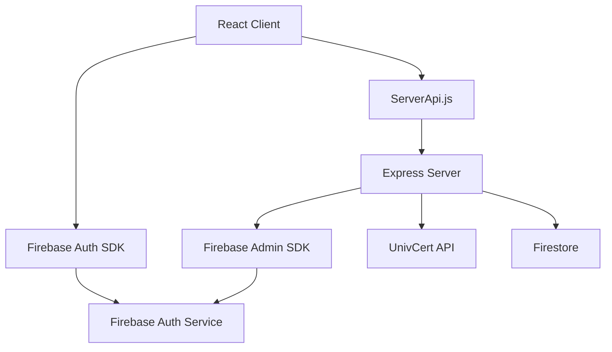

# Firebase 인증 시스템 완전 가이드

## 📋 목차
1. [프로젝트 개요](#프로젝트-개요)
2. [아키텍처 구조](#아키텍처-구조)
3. [Firebase 설정](#firebase-설정)
4. [클라이언트 측 인증](#클라이언트-측-인증)
5. [서버 측 인증](#서버-측-인증)
6. [인증 플로우 상세 분석](#인증-플로우-상세-분석)
7. [클라이언트만으로 인증 가능한가?](#클라이언트만으로-인증-가능한가)
8. [실제 코드 예제](#실제-코드-예제)
9. [보안 고려사항](#보안-고려사항)
10. [문제 해결 가이드](#문제-해결-가이드)

---

## 🏗️ 프로젝트 개요

StudyBuddy 프로젝트는 **하이브리드 Firebase 인증 시스템**을 사용합니다:
- **클라이언트**: Firebase SDK를 통한 직접 인증
- **서버**: Firebase Admin SDK를 통한 토큰 검증 및 추가 검증
- **이메일 인증**: UnivCert API를 통한 대학 이메일 검증

### 사용 기술 스택
```
Frontend: React + Firebase SDK v9
Backend: Node.js + Express + Firebase Admin SDK
Database: Firestore
Email Verification: UnivCert API
```

---

## 🔧 아키텍처 구조



### 주요 컴포넌트 역할

| 컴포넌트 | 역할 | 파일 위치 |
|---------|------|-----------|
| AuthContext.jsx | 클라이언트 인증 상태 관리 | `client/src/contexts/AuthContext.jsx` |
| firebase.js | Firebase 클라이언트 설정 | `client/src/firebase.js` |
| ServerApi.js | 서버 API 통신 | `client/src/utils/ServerApi.js` |
| auth.js | 서버 인증 라우트 | `server/routes/auth.js` |
| firebase.js | Firebase 서버 설정 | `server/config/firebase.js` |

---

## 🔥 Firebase 설정

### 클라이언트 설정 (`client/src/firebase.js`)

```javascript
import { initializeApp } from "firebase/app";
import { getAuth } from 'firebase/auth';
import { getFirestore } from 'firebase/firestore';

// 환경변수에서 Firebase 설정 로드
const firebaseConfig = {
  apiKey: import.meta.env.VITE_FIREBASE_API_KEY,
  authDomain: import.meta.env.VITE_FIREBASE_AUTH_DOMAIN,
  projectId: import.meta.env.VITE_FIREBASE_PROJECT_ID,
  // ... 기타 설정
};

const app = initializeApp(firebaseConfig);
export const auth = getAuth(app);
export const db = getFirestore(app);
```

### 서버 설정 (`server/config/firebase.js`)

```javascript
const admin = require('firebase-admin');
const serviceAccount = require('./serviceAccountKey.json');

// Firebase Admin SDK 초기화
admin.initializeApp({
  credential: admin.credential.cert(serviceAccount)
});

const firestore = admin.firestore();
module.exports = { admin, firestore };
```

---

## 💻 클라이언트 측 인증

### AuthContext의 핵심 함수들

#### 1. 회원가입 (Signup)

```javascript
async function signup(email, password, displayName) {
  try {
    // 1. Firebase 클라이언트 인증
    const userCredential = await createUserWithEmailAndPassword(auth, email, password);
    const user = userCredential.user;
    
    // 2. 서버에 사용자 등록 (추가 검증)
    const token = await user.getIdToken();
    await ServerApi.registerUser(token, {
      email,
      displayName,
      verified: false,
      certified_date: null
    });
    
    // 3. Firestore에 프로필 생성 (백업)
    await setDoc(doc(firestore, 'users', user.uid), {
      uid: user.uid,
      email,
      displayName,
      certified_email: false,
      createdAt: serverTimestamp()
    });
    
    return user;
  } catch (error) {
    console.error("회원가입 오류:", error);
    throw error;
  }
}
```

#### 2. 로그인 (Login)

```javascript
async function login(email, password) {
  try {
    // 1. Firebase 클라이언트 인증
    const userCredential = await signInWithEmailAndPassword(auth, email, password);
    
    // 2. 서버 인증 (토큰 검증)
    const token = await userCredential.user.getIdToken();
    await ServerApi.loginUser(token);
    
    return userCredential;
  } catch (error) {
    console.error("로그인 오류:", error);
    throw error;
  }
}
```

#### 3. 로그아웃 (Logout)

```javascript
async function logout() {
  try {
    // 1. 서버에서 토큰 무효화
    if (currentUser) {
      const token = await currentUser.getIdToken();
      await ServerApi.logoutUser(token);
    }
    
    // 2. Firebase 클라이언트 로그아웃
    await signOut(auth);
  } catch (error) {
    console.error("로그아웃 오류:", error);
    throw error;
  }
}
```

---

## 🖥️ 서버 측 인증

### 토큰 검증 미들웨어

```javascript
const verifyFirebaseToken = async (req, res, next) => {
  try {
    const authHeader = req.headers.authorization;
    
    if (!authHeader || !authHeader.startsWith('Bearer ')) {
      return res.status(401).json({
        success: false,
        message: '인증 토큰이 필요합니다.'
      });
    }

    const token = authHeader.substring(7);
    
    // Firebase Admin SDK로 토큰 검증
    const decodedToken = await admin.auth().verifyIdToken(token);
    req.user = decodedToken;
    next();
  } catch (error) {
    return res.status(401).json({
      success: false,
      message: '유효하지 않은 토큰입니다.'
    });
  }
};
```

### 주요 API 엔드포인트

#### 1. 회원가입 검증 (`POST /api/auth/register`)

```javascript
router.post('/register', verifyFirebaseToken, async (req, res) => {
  try {
    const uid = req.user.uid;
    const email = req.user.email;
    
    // 중복 사용자 확인
    const userDoc = await firestore.collection('users').doc(uid).get();
    if (userDoc.exists) {
      return res.status(200).json({
        success: true,
        message: '이미 등록된 사용자입니다.'
      });
    }
    
    // 충북대 이메일 검증
    if (!email.endsWith('@chungbuk.ac.kr')) {
      return res.status(400).json({
        success: false,
        message: '충북대학교 이메일만 가입 가능합니다.'
      });
    }
    
    // Firestore에 사용자 데이터 저장
    await firestore.collection('users').doc(uid).set({
      uid,
      email,
      certified_email: false,
      createdAt: new Date().toISOString()
    });
    
    res.status(201).json({
      success: true,
      message: '회원가입이 완료되었습니다.'
    });
  } catch (error) {
    res.status(500).json({
      success: false,
      message: '서버 오류가 발생했습니다.'
    });
  }
});
```

#### 2. 로그인 검증 (`POST /api/auth/login`)

```javascript
router.post('/login', verifyFirebaseToken, async (req, res) => {
  try {
    const uid = req.user.uid;
    
    // 사용자 존재 확인
    const userDoc = await firestore.collection('users').doc(uid).get();
    if (!userDoc.exists) {
      return res.status(404).json({
        success: false,
        message: '등록되지 않은 사용자입니다.'
      });
    }
    
    // 마지막 로그인 시간 업데이트
    await firestore.collection('users').doc(uid).update({
      lastLoginAt: new Date().toISOString()
    });
    
    res.status(200).json({
      success: true,
      message: '로그인이 완료되었습니다.',
      user: userDoc.data()
    });
  } catch (error) {
    res.status(500).json({
      success: false,
      message: '서버 오류가 발생했습니다.'
    });
  }
});
```

#### 3. 로그아웃 (`POST /api/auth/logout`)

```javascript
router.post('/logout', verifyFirebaseToken, async (req, res) => {
  try {
    const uid = req.user.uid;
    
    // Firebase Admin SDK를 통해 모든 토큰 무효화
    await admin.auth().revokeRefreshTokens(uid);
    
    res.status(200).json({
      success: true,
      message: '로그아웃이 완료되었습니다.'
    });
  } catch (error) {
    res.status(500).json({
      success: false,
      message: '로그아웃 중 오류가 발생했습니다.'
    });
  }
});
```

---

## 🔄 인증 플로우 상세 분석

### 회원가입 플로우

```
1. 사용자가 이메일/비밀번호 입력
   ↓
2. 클라이언트에서 Firebase Auth에 계정 생성 요청
   ↓
3. Firebase Auth에서 사용자 계정 생성 및 ID 토큰 발급
   ↓
4. 클라이언트에서 ID 토큰과 함께 서버 /api/auth/register 호출
   ↓
5. 서버에서 토큰 검증 및 이메일 도메인 확인
   ↓
6. Firestore에 사용자 프로필 저장
   ↓
7. 클라이언트에서 로컬 Firestore에도 프로필 백업 저장
```

### 로그인 플로우

```
1. 사용자가 이메일/비밀번호 입력
   ↓
2. 클라이언트에서 Firebase Auth에 로그인 요청
   ↓
3. Firebase Auth에서 인증 후 ID 토큰 발급
   ↓
4. 클라이언트에서 ID 토큰과 함께 서버 /api/auth/login 호출
   ↓
5. 서버에서 토큰 검증 및 사용자 존재 확인
   ↓
6. 로그인 시간 업데이트
   ↓
7. 클라이언트에서 사용자 프로필 로드
```

### 로그아웃 플로우

```
1. 사용자가 로그아웃 버튼 클릭
   ↓
2. 클라이언트에서 현재 ID 토큰과 함께 서버 /api/auth/logout 호출
   ↓
3. 서버에서 Firebase Admin SDK를 통해 모든 리프레시 토큰 무효화
   ↓
4. 클라이언트에서 Firebase Auth 로그아웃
   ↓
5. 로컬 상태 초기화 (currentUser, userProfile = null)
```

---

## ❓ 클라이언트만으로 인증 가능한가?

### ✅ 가능한 것들

**Firebase SDK만으로도 완전한 인증 시스템을 구축할 수 있습니다:**

```javascript
// 클라이언트 전용 인증 예제
import { auth } from './firebase';
import { 
  createUserWithEmailAndPassword,
  signInWithEmailAndPassword,
  signOut,
  onAuthStateChanged 
} from 'firebase/auth';

// 회원가입
const signup = async (email, password) => {
  const userCredential = await createUserWithEmailAndPassword(auth, email, password);
  return userCredential.user;
};

// 로그인
const login = async (email, password) => {
  const userCredential = await signInWithEmailAndPassword(auth, email, password);
  return userCredential.user;
};

// 로그아웃
const logout = async () => {
  await signOut(auth);
};

// 인증 상태 감지
onAuthStateChanged(auth, (user) => {
  if (user) {
    console.log('로그인됨:', user.uid);
  } else {
    console.log('로그아웃됨');
  }
});
```

### 🚫 제한사항

**하지만 다음과 같은 이유로 서버가 필요합니다:**

1. **비즈니스 로직 검증**
   - 이메일 도메인 제한 (@chungbuk.ac.kr만 허용)
   - 사용자 역할 및 권한 관리
   - 복잡한 비즈니스 규칙

2. **외부 API 연동**
   - UnivCert API를 통한 실제 대학 이메일 검증
   - API 키 보안 (클라이언트에 노출되면 안됨)

3. **고급 보안 기능**
   - 토큰 무효화 (강제 로그아웃)
   - 사용자 계정 관리
   - 감사 로그

4. **데이터 무결성**
   - 서버 측 데이터 검증
   - 중복 방지
   - 일관성 보장

### 💡 권장 아키텍처

```javascript
// 단순한 프로젝트 - 클라이언트만 사용
const simpleAuth = {
  pros: ['빠른 개발', '낮은 복잡성', '비용 절약'],
  cons: ['제한된 보안', '비즈니스 로직 부족', '확장성 제한'],
  적합한경우: ['프로토타입', '개인 프로젝트', '단순한 앱']
};

// 복잡한 프로젝트 - 하이브리드 방식 (현재 StudyBuddy)
const hybridAuth = {
  pros: ['강력한 보안', '유연한 비즈니스 로직', '확장 가능'],
  cons: ['높은 복잡성', '서버 운영 비용', '개발 시간 증가'],
  적합한경우: ['상용 서비스', '기업 애플리케이션', '복잡한 권한 시스템']
};
```

---

## 💻 실제 코드 예제

### 클라이언트에서 서버 API 호출

```javascript
// ServerApi.js 사용 예제
import ServerApi from '../utils/ServerApi';
import { auth } from '../firebase';

const handleLogin = async (email, password) => {
  try {
    // 1. Firebase 인증
    const userCredential = await signInWithEmailAndPassword(auth, email, password);
    
    // 2. ID 토큰 가져오기
    const token = await userCredential.user.getIdToken();
    
    // 3. 서버 인증
    const serverResponse = await ServerApi.loginUser(token);
    console.log('서버 인증 성공:', serverResponse);
    
    // 4. 사용자 프로필 로드
    const profile = await ServerApi.getUserProfile(token);
    setUserProfile(profile);
    
  } catch (error) {
    console.error('로그인 실패:', error.message);
  }
};
```

### 서버에서 토큰 검증

```javascript
// auth.js 라우트에서 토큰 검증
const verifyAndGetUser = async (token) => {
  try {
    // Firebase Admin SDK로 토큰 검증
    const decodedToken = await admin.auth().verifyIdToken(token);
    
    // Firestore에서 사용자 데이터 조회
    const userDoc = await firestore.collection('users').doc(decodedToken.uid).get();
    
    if (!userDoc.exists) {
      throw new Error('사용자를 찾을 수 없습니다');
    }
    
    return {
      uid: decodedToken.uid,
      email: decodedToken.email,
      profile: userDoc.data()
    };
  } catch (error) {
    throw new Error('토큰 검증 실패');
  }
};
```

### 이메일 인증 구현

```javascript
// UnivCert API를 통한 대학 이메일 인증
router.post('/verify-email', async (req, res) => {
  try {
    const { email } = req.body;
    
    // 기본 이메일 형식 검증
    if (!email.endsWith('@chungbuk.ac.kr')) {
      return res.status(400).json({
        success: false,
        message: '충북대학교 이메일만 사용 가능합니다.'
      });
    }
    
    // UnivCert API 호출
    const response = await axios.post('https://univcert.com/api/v1/certify', {
      key: process.env.UNIVCERT_API_KEY,
      email: email,
      univName: '충북대학교',
      univ_check: true
    });
    
    if (response.data.success) {
      return res.status(200).json({
        success: true,
        message: '이메일 인증이 완료되었습니다.',
        certified_date: new Date().toISOString()
      });
    } else {
      return res.status(400).json({
        success: false,
        message: '이메일 인증에 실패했습니다.'
      });
    }
  } catch (error) {
    console.error('이메일 인증 오류:', error);
    return res.status(500).json({
      success: false,
      message: '서버 오류가 발생했습니다.'
    });
  }
});
```

---

## 🔒 보안 고려사항

### 1. 토큰 보안

```javascript
// ✅ 올바른 토큰 처리
const token = await user.getIdToken();
// 토큰을 Authorization 헤더에 포함
headers: {
  'Authorization': `Bearer ${token}`
}

// ❌ 잘못된 토큰 처리
localStorage.setItem('token', token); // 보안상 위험
```

### 2. API 키 보안

```javascript
// ✅ 서버에서만 사용 (안전)
const response = await axios.post('https://univcert.com/api/v1/certify', {
  key: process.env.UNIVCERT_API_KEY, // 환경변수 사용
  email: email
});

// ❌ 클라이언트에서 사용 (위험)
const apiKey = 'your-secret-api-key'; // 클라이언트 코드에 노출됨
```

### 3. 입력값 검증

```javascript
// 서버에서 이중 검증
const validateInput = (email, password) => {
  // 1. 기본 형식 검증
  if (!email || !email.includes('@')) {
    throw new Error('유효하지 않은 이메일');
  }
  
  // 2. 도메인 검증
  if (!email.endsWith('@chungbuk.ac.kr')) {
    throw new Error('충북대학교 이메일만 허용');
  }
  
  // 3. 비밀번호 강도 검증
  if (password.length < 6) {
    throw new Error('비밀번호는 6자 이상이어야 합니다');
  }
};
```

### 4. CORS 설정

```javascript
// server.js에서 CORS 설정
app.use(cors({
  origin: ['http://localhost:5173', 'https://yourdomain.com'],
  credentials: true
}));
```

---

## 🔧 문제 해결 가이드

### 자주 발생하는 오류들

#### 1. "auth/invalid-email" 오류

```javascript
// 원인: 잘못된 이메일 형식
// 해결책: 이메일 형식 검증 추가
const validateEmail = (email) => {
  const emailRegex = /^[^\s@]+@[^\s@]+\.[^\s@]+$/;
  return emailRegex.test(email);
};
```

#### 2. "auth/weak-password" 오류

```javascript
// 원인: 비밀번호가 6자 미만
// 해결책: 비밀번호 강도 검증
const validatePassword = (password) => {
  if (password.length < 6) {
    throw new Error('비밀번호는 최소 6자 이상이어야 합니다');
  }
};
```

#### 3. 토큰 만료 오류

```javascript
// 해결책: 토큰 자동 갱신
auth.onAuthStateChanged(async (user) => {
  if (user) {
    try {
      // 토큰이 만료되기 전에 새로 갱신
      const token = await user.getIdToken(true); // force refresh
      // 새 토큰으로 API 호출
    } catch (error) {
      console.error('토큰 갱신 실패:', error);
      // 다시 로그인 필요
    }
  }
});
```

#### 4. 네트워크 오류

```javascript
// 해결책: 재시도 로직 구현
const retryRequest = async (requestFn, maxRetries = 3) => {
  for (let i = 0; i < maxRetries; i++) {
    try {
      return await requestFn();
    } catch (error) {
      if (i === maxRetries - 1) throw error;
      await new Promise(resolve => setTimeout(resolve, 1000 * Math.pow(2, i)));
    }
  }
};
```

### 디버깅 팁

```javascript
// 1. 상세한 로깅 추가
console.log('인증 시작:', { email, timestamp: new Date().toISOString() });

// 2. 에러 정보 수집
catch (error) {
  console.error('인증 오류 상세:', {
    code: error.code,
    message: error.message,
    stack: error.stack
  });
}

// 3. 토큰 상태 확인
const checkTokenStatus = async () => {
  if (auth.currentUser) {
    const token = await auth.currentUser.getIdToken();
    console.log('현재 토큰:', token.substring(0, 20) + '...');
  }
};
```

---

## 📚 추가 리소스

### Firebase 공식 문서
- [Firebase Auth 가이드](https://firebase.google.com/docs/auth)
- [Firebase Admin SDK](https://firebase.google.com/docs/admin/setup)

### React Firebase 통합
- [React Firebase Hooks](https://github.com/CSFrequency/react-firebase-hooks)
- [Firebase v9 마이그레이션 가이드](https://firebase.google.com/docs/web/modular-upgrade)

### 보안 모범 사례
- [Firebase 보안 규칙](https://firebase.google.com/docs/firestore/security/get-started)
- [JWT 토큰 보안](https://auth0.com/blog/a-look-at-the-latest-draft-for-jwt-bcp/)